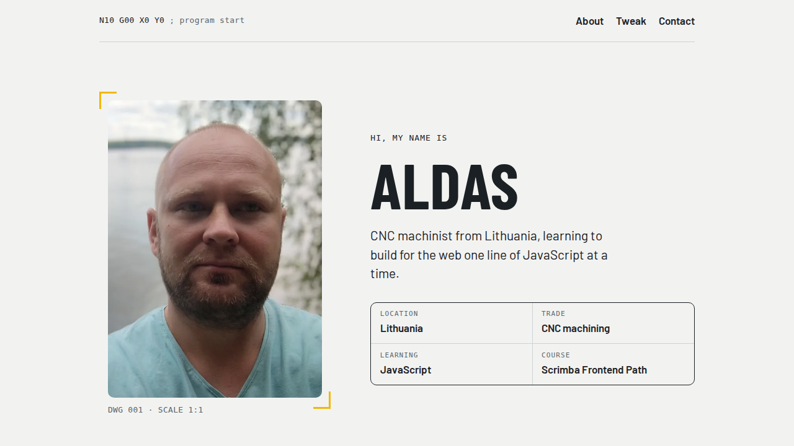

# Personal Site

> My first web page: a personal profile you can restyle with JavaScript. Built during Scrimba's Frontend Developer Career Path.

**[🔗 Live demo](https://brutall100.github.io/scrimba-personal-site/)** · [Code](https://github.com/brutall100/scrimba-personal-site)



## About

A one-page personal site introducing me: a CNC machinist from Lithuania who is learning web development.
The page borrows from the machine shop: section markers are written like G-code blocks (`N10`, `N20`, …, `M30`), and the facts about me sit in a table that looks like the title block on a technical drawing.

The original Scrimba challenge was to restyle the page by calling four JavaScript functions with your favourites.
I turned that into a **"Make it yours"** panel so visitors can try it themselves.

## Features

- **Restyle the page live**: pick a movie genre (headline font), a fruit (accent colour), light/dark mode and an edge style (corner radius)
- **Remembers your picks** in `localStorage`
- **Shows the code** behind each choice, e.g. `favouriteFruit("blueberry")`
- **Light and dark mode** that follows your system setting by default
- **Responsive** from phones to wide screens
- **Accessible**: semantic HTML, keyboard focus styles, skip link, respects reduced motion

## Built with

- HTML5
- CSS3 (custom properties, grid, flexbox, `color-mix()`)
- Vanilla JavaScript (no frameworks, no build step)

## What I learned

- How **CSS custom properties** (variables) let one line of JavaScript change the whole look of a page
- Building UI from data: the picker buttons are generated from one `OPTIONS` object
- Saving small settings in `localStorage`, safely wrapped in `try/catch`
- Making a layout that works on both phone and desktop

## Run it locally

No install needed, it is plain HTML, CSS and JS.

```bash
git clone https://github.com/brutall100/scrimba-personal-site.git
cd scrimba-personal-site
```

Then open `index.html` in your browser.

## Project structure

```
.
├── index.html      # page content
├── styles.css      # design tokens, layout, light/dark themes
├── index.js        # "Make it yours" style picker
├── images/         # portrait (JPG + WebP)
└── docs/           # screenshot for this README
```

## Credits

- Course: [Scrimba Frontend Developer Career Path](https://scrimba.com/learn/frontend)
- Fonts: [Google Fonts](https://fonts.google.com/): Barlow, Barlow Condensed, JetBrains Mono and the genre fonts

---

Made by **Aldas** · [GitHub](https://github.com/brutall100) · [X / Twitter](https://x.com/brutall100)
